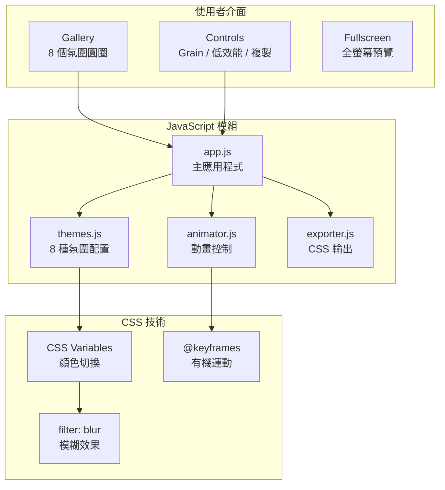

# Aura Moods 動態氛圍色票

[](https://opensource.org/licenses/MIT)
[](https://developer.mozilla.org/docs/Web/JavaScript)
[](https://developer.mozilla.org/docs/Web/CSS)

[← 回到 Muripo HQ](https://tznthou.github.io/muripo-hq/) | [English](README_EN.md)

一個專注於「動態背景」的色票庫。使用者不是挑選單一顏色，而是挑選一種「流動的氛圍」。一鍵複製 CSS，即可為任何網站加入高品質的 Mesh Gradient 背景。

---

## 功能特色

- **8 種精選氛圍**：從極光夢境到午夜爵士，涵蓋各種視覺情境
- **即時預覽**：點擊圓圈立即切換背景效果
- **全螢幕預覽**：沉浸式體驗完整的氛圍效果
- **一鍵複製 CSS**：含動畫版 / 純漸層版 / Tailwind Token
- **顆粒質感**：可開關的 Grain Overlay，提升視覺質感
- **低效能模式**：降低模糊效果，適合效能較低的設備
- **OKLCH 色域**：現代色彩空間，漸層過渡更自然
- **響應式設計**：桌機網格、手機水平滾動

---

## 系統架構



---

## 氛圍一覽

| 名稱 | 英文 | 色系 | 適用場景 |
|------|------|------|----------|
| **極光夢境** | Aurora | 藍紫粉 | 夢幻、科幻、Landing Page |
| **日落熔岩** | Sunset | 橙紅紫 | 溫暖、活力、促銷頁面 |
| **深海珊瑚** | Ocean | 青藍綠 | 冷靜、專業、企業網站 |
| **薰衣草田** | Lavender | 紫粉白 | 放鬆、療癒、SPA 品牌 |
| **熱帶雨林** | Jungle | 綠黃青 | 自然、清新、環保主題 |
| **午夜爵士** | Midnight | 深藍紫黑 | 神秘、高級、精品網站 |
| **桃花源記** | Peach | 粉橙白 | 可愛、溫柔、女性品牌 |
| **星際迷航** | Cosmic | 深紫藍粉 | 未來、探索、科技產品 |

---

## 技術棧

| 技術 | 用途 | 備註 |
|------|------|------|
| Vanilla JavaScript | 模組化架構 | ES6+ Modules |
| CSS Variables | 動態顏色切換 | 平滑過渡效果 |
| CSS @keyframes | 有機運動動畫 | 4 種不同軌跡 |
| OKLCH Color | 現代色彩空間 | 含 RGB fallback |
| SVG Noise Filter | 顆粒質感 | 可調透明度 |
| GPU Acceleration | 效能優化 | will-change, translateZ |

---

## 快速開始

### 直接開啟

```bash
# 直接用瀏覽器開啟
open index.html

# 或使用本地伺服器（推薦）
npx serve .
```

### 操作方式

1. **選擇氛圍**：點擊任一氛圍圓圈
2. **調整設定**：開關顆粒質感 / 低效能模式
3. **複製 CSS**：選擇「含動畫」或「純漸層」版本
4. **查看說明**：點擊「如何使用？」了解如何在你的網站使用

---

## 專案結構

```
day-17-aura-moods/
├── index.html              # 主頁面
├── help.html               # 使用說明頁
├── css/
│   └── style.css           # 樣式表
├── js/
│   ├── app.js              # 主應用程式
│   ├── themes.js           # 8 種氛圍配置
│   ├── animator.js         # 動畫控制器
│   └── exporter.js         # CSS 輸出模組
├── assets/
│   └── grain.svg           # 顆粒質感
├── README.md               # 說明文件（中文）
└── README_EN.md            # 說明文件（英文）
```

---

## 輸出範例

點擊「複製 CSS（含動畫）」會複製完整的 CSS：

```css
/* ===========================================
   極光夢境 (Aurora) - Aura Moods
   =========================================== */

:root {
  --blob-1: rgb(80, 120, 220);
  --blob-2: rgb(160, 80, 200);
  --blob-3: rgb(255, 130, 180);
  --blob-4: rgb(100, 200, 255);
  --bg-base: rgb(15, 15, 35);
  --blur-amount: 120px;
}

@supports (color: oklch(0% 0 0)) {
  :root {
    --blob-1: oklch(55% 0.18 260);
    /* ... */
  }
}

.aura-background {
  position: fixed;
  inset: 0;
  z-index: -1;
  overflow: hidden;
  background: var(--bg-base);
}

.blob {
  position: absolute;
  border-radius: 50%;
  filter: blur(var(--blur-amount));
  /* ... */
}

@keyframes float-1 {
  0%, 100% { transform: translate(0, 0) scale(1); }
  25% { transform: translate(15%, 20%) scale(1.05); }
  /* ... */
}
```

---

## 兩種輸出版本

| 版本 | 內容 | 檔案大小 | 適用場景 |
|------|------|----------|----------|
| **含動畫** | CSS Variables + @keyframes | 較大 | Landing Page、作品集 |
| **純漸層** | CSS Variables only | 較小 | Dashboard、文章頁 |

---

## 注意事項

### 關於 OKLCH 色域

本工具使用 OKLCH 色彩空間，讓漸層過渡更自然。但需要注意：

- **支援瀏覽器**：Chrome 111+、Safari 15.4+、Firefox 113+
- **自動 Fallback**：舊瀏覽器會使用 RGB 顏色

```css
/* 自動 fallback 機制 */
--blob-1: rgb(80, 120, 220);      /* 舊瀏覽器 */
--blob-1: oklch(55% 0.18 260);    /* 現代瀏覽器 */
```

### 關於效能

`filter: blur(120px)` 是較重的 GPU 操作。如果遇到卡頓：

1. 開啟「低效能模式」
2. 使用「純漸層」版本
3. 減少 blob 數量（刪除 blob-3、blob-4）

---

## 隨想

### 氛圍的價值

顏色不只是顏色，它是一種感覺。

當設計師說「我要科技感」，他們其實在說：冷色調、高對比、深色背景。當客戶說「我要溫暖一點」，他們在說：暖色漸層、柔和過渡、明亮底色。

Aura Moods 把這些「感覺」變成可複製的 CSS。你不需要是配色專家，只需要知道你想要什麼「氛圍」。

### 動態的意義

靜態的漸層是一張圖。動態的漸層是一種體驗。

當光球緩慢漂浮時，你的網站不再只是一個頁面，而是一個有生命力的空間。這種微妙的動態，讓使用者感受到「這裡有人在乎細節」。

### 給 Vibe Coder 的話

複製貼上很容易，但理解為什麼這樣設計更重要。

每個氛圍的顏色都經過 OKLCH 調整，確保漸層過渡自然。每個動畫的時間都刻意錯開，避免規律的循環感。這些細節，才是讓效果看起來「高級」的原因。

下次當你使用這些 CSS 時，試著調整一下參數，看看會發生什麼。那才是真正學習的開始。

---

## 授權

本專案採用 [MIT License](LICENSE) 授權。
