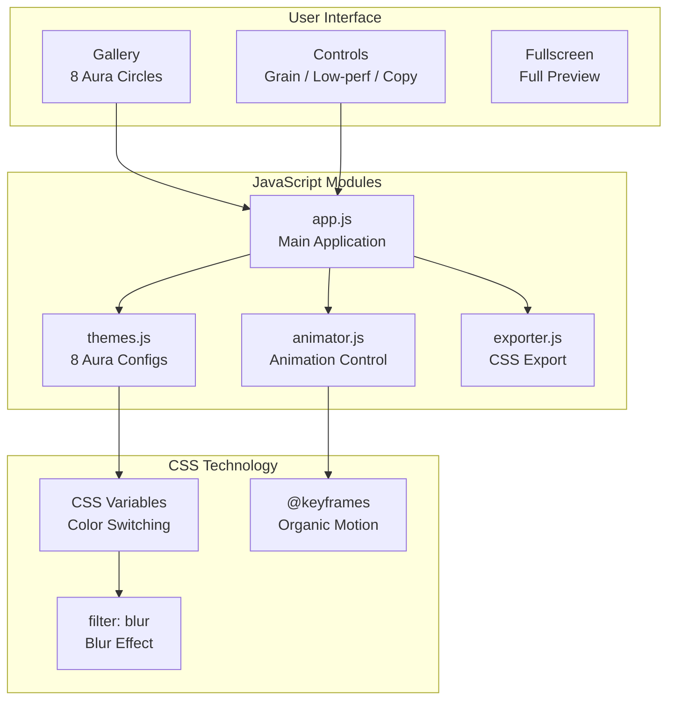

# Aura Moods - Dynamic Ambient Color Palette

[](https://opensource.org/licenses/MIT)
[](https://developer.mozilla.org/docs/Web/JavaScript)
[](https://developer.mozilla.org/docs/Web/CSS)

[← Back to Muripo HQ](https://tznthou.github.io/muripo-hq/) | [中文](README.md)

A color palette library focused on "dynamic backgrounds". Instead of picking a single color, users pick a flowing "aura". One-click copy CSS to add high-quality Mesh Gradient backgrounds to any website.

---

## Features

- **8 Curated Auras**: From Aurora dreams to Midnight jazz, covering various visual moods
- **Live Preview**: Click any circle to instantly switch background effects
- **Fullscreen Preview**: Immersive experience of the complete aura effect
- **One-Click Copy**: Animated CSS / Static gradient / Tailwind Token
- **Grain Texture**: Toggleable grain overlay for enhanced visual quality
- **Low Performance Mode**: Reduced blur effects for lower-end devices
- **OKLCH Color Space**: Modern color space for smoother gradient transitions
- **Responsive Design**: Desktop grid, mobile horizontal scroll

---

## Architecture



---

## Aura Gallery

| Name | Chinese | Colors | Use Cases |
|------|---------|--------|-----------|
| **Aurora** | 極光夢境 | Blue-Purple-Pink | Dreamy, Sci-fi, Landing Pages |
| **Sunset** | 日落熔岩 | Orange-Red-Purple | Warm, Energetic, Promo Pages |
| **Ocean** | 深海珊瑚 | Cyan-Blue-Green | Calm, Professional, Corporate |
| **Lavender** | 薰衣草田 | Purple-Pink-White | Relaxing, Healing, SPA Brands |
| **Jungle** | 熱帶雨林 | Green-Yellow-Cyan | Natural, Fresh, Eco Themes |
| **Midnight** | 午夜爵士 | Deep Blue-Purple-Black | Mysterious, Luxury, Premium |
| **Peach** | 桃花源記 | Pink-Orange-White | Cute, Gentle, Feminine Brands |
| **Cosmic** | 星際迷航 | Deep Purple-Blue-Pink | Futuristic, Explorative, Tech |

---

## Tech Stack

| Technology | Purpose | Notes |
|------------|---------|-------|
| Vanilla JavaScript | Modular Architecture | ES6+ Modules |
| CSS Variables | Dynamic Color Switching | Smooth Transitions |
| CSS @keyframes | Organic Motion Animation | 4 Different Trajectories |
| OKLCH Color | Modern Color Space | With RGB Fallback |
| SVG Noise Filter | Grain Texture | Adjustable Opacity |
| GPU Acceleration | Performance | will-change, translateZ |

---

## Quick Start

### Direct Open

```bash
# Open directly in browser
open index.html

# Or use local server (recommended)
npx serve .
```

### How to Use

1. **Select Aura**: Click any aura circle
2. **Adjust Settings**: Toggle grain texture / low performance mode
3. **Copy CSS**: Choose "Animated" or "Static" version
4. **View Guide**: Click "How to use?" for integration instructions

---

## Project Structure

```
day-17-aura-moods/
├── index.html              # Main page
├── help.html               # Usage guide
├── css/
│   └── style.css           # Stylesheets
├── js/
│   ├── app.js              # Main application
│   ├── themes.js           # 8 aura configurations
│   ├── animator.js         # Animation controller
│   └── exporter.js         # CSS export module
├── assets/
│   └── grain.svg           # Grain texture
├── README.md               # Documentation (Chinese)
└── README_EN.md            # Documentation (English)
```

---

## Export Example

Clicking "Copy CSS (Animated)" copies complete CSS:

```css
/* ===========================================
   Aurora - Aura Moods
   =========================================== */

:root {
  --blob-1: rgb(80, 120, 220);
  --blob-2: rgb(160, 80, 200);
  --blob-3: rgb(255, 130, 180);
  --blob-4: rgb(100, 200, 255);
  --bg-base: rgb(15, 15, 35);
  --blur-amount: 120px;
}

@supports (color: oklch(0% 0 0)) {
  :root {
    --blob-1: oklch(55% 0.18 260);
    /* ... */
  }
}

.aura-background {
  position: fixed;
  inset: 0;
  z-index: -1;
  overflow: hidden;
  background: var(--bg-base);
}

.blob {
  position: absolute;
  border-radius: 50%;
  filter: blur(var(--blur-amount));
  /* ... */
}

@keyframes float-1 {
  0%, 100% { transform: translate(0, 0) scale(1); }
  25% { transform: translate(15%, 20%) scale(1.05); }
  /* ... */
}
```

---

## Two Output Versions

| Version | Content | File Size | Use Cases |
|---------|---------|-----------|-----------|
| **Animated** | CSS Variables + @keyframes | Larger | Landing Pages, Portfolios |
| **Static** | CSS Variables only | Smaller | Dashboards, Article Pages |

---

## Notes

### About OKLCH Color Space

This tool uses OKLCH color space for more natural gradient transitions:

- **Supported Browsers**: Chrome 111+, Safari 15.4+, Firefox 113+
- **Auto Fallback**: Older browsers will use RGB colors

```css
/* Automatic fallback mechanism */
--blob-1: rgb(80, 120, 220);      /* Old browsers */
--blob-1: oklch(55% 0.18 260);    /* Modern browsers */
```

### About Performance

`filter: blur(120px)` is a heavy GPU operation. If experiencing lag:

1. Enable "Low Performance Mode"
2. Use "Static" version
3. Reduce blob count (remove blob-3, blob-4)

---

## Thoughts

### The Value of Ambiance

Colors aren't just colors—they're feelings.

When designers say "I want a tech feel," they mean: cool tones, high contrast, dark backgrounds. When clients say "make it warmer," they mean: warm gradients, soft transitions, bright bases.

Aura Moods turns these "feelings" into copyable CSS. You don't need to be a color expert—just know what "vibe" you want.

### The Meaning of Motion

A static gradient is an image. A dynamic gradient is an experience.

When light blobs slowly drift, your website becomes more than a page—it becomes a living space. This subtle motion tells users "someone here cares about details."

### For Vibe Coders

Copy-paste is easy, but understanding why it's designed this way matters more.

Each aura's colors are OKLCH-tuned for natural gradient transitions. Each animation's timing is deliberately staggered to avoid repetitive loops. These details are what make effects look "premium."

Next time you use these CSS snippets, try tweaking the parameters. See what happens. That's where real learning begins.

---

## License

This project is licensed under the [MIT License](LICENSE).
